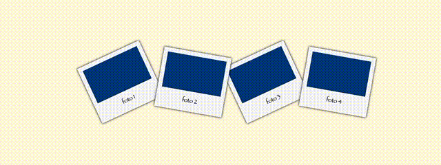
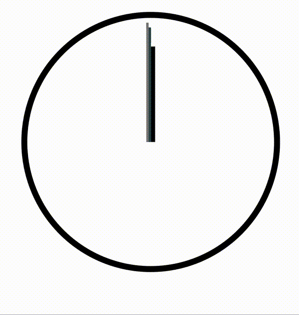

# Examen 3ª Evaluación

Prueba práctica de la tercera evaluación de Lenguajes de Marcas.

*Contenidos:*
- Animaciones CSS
- Transformaciones CSS
- XML y XSL

*Conocimientos previos:*
- HTML5
- CSS3
- Flexbox
- Grid(opcional)

*Consideraciones:*

En la carpeta [0_recursos](./0_recursos/) hay imágenes y vídeos explicativos sobre lo que se espera conseguir exactamente.

## Enunciados

### 1. Polaroids (5 pts)

Maquetar 4 tarjetas a modo de fotos polaroid:

- **(0,5 pt)** Cada polaroid ha de tener como máximo un ancho de 200px, un margen interno de 12px, y un espacio reservado para la imagen de mínimo 100px 
- **(0,75 pt)** Todas la imágenes tienen que mostrar una animación de cambio de colores (rojo, naranja, amarillo, verde y azul) que dure 4 segundos y medio de forma indefinida como se muestra en la imagen 
- **(0,5 pt)** Cada polaroid ha de reproducir la animación de cambio de color con un segundo de retraso respecto a la polaroid de su izquierda. 
- **(1 pt)** Las polaroids pares han de estar giradas 10 grados en sentido horario y las impares 25 en antihorario. Además, las polaroids pares han de estar por encima de las impares 
- **(0,75 pt)** Cada foto ha de agrandarse y situarse encima del resto cuando se pasa el ratón por encima 
- **(0,75 pt)** También, al pasar el ratón por encima, han de mostrar alrchivo `1_good-old-rick.gif` situado en la carpeta [0_recursos](./0_recursos/) en vez de la animación de los colores 
- **(0,75 pt)** Uso correcto de clases e ids, nombres de clases descriptivos, evitar repetición de código, etc 

### 2. Reloj (2,5 pts)

Crear un reloj utilizando CSS y la estructura HTML dada.

- **(1 pt)** Segundero 
- **(0,5 pt)** Minutos 
- **(0,5 pt)** Horas 
- **(0,5 pt)** Estilo cuidado, código conciso, etc ... 

### 3. Tienda (2,5 pts)

- **(0,5 pt)** Crear un HTML utilizando un fichero .xsl partiendo del .xml dado 
- **(1 pt)** Añadir un apartado de productos con al menos 4 productos distintos con título, descripción y precio  
- **(1 pt)** Utilizar formato de tarjetas, uso adecuado de clases e ids, cuidar estilos y responsive 